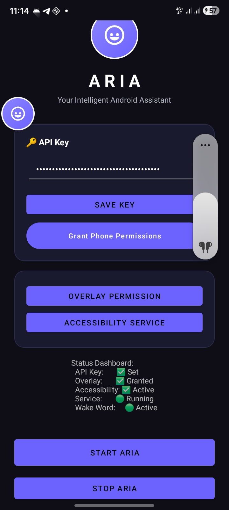
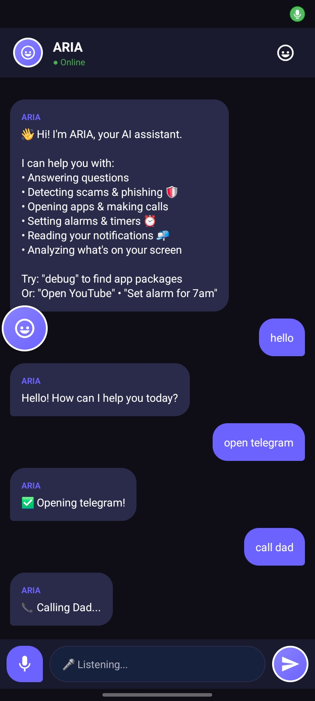
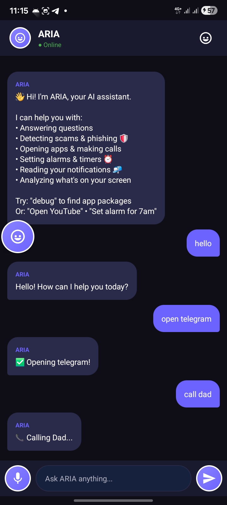

# ARIA – Android AI Assistant

ARIA is an Android-based AI assistant inspired by JARVIS and FRIDAY.

I built ARIA to explore how AI can become more visual, interactive, and accessible—especially for people in communities with limited access to advanced technology.

---

## Features

✅ Voice interaction  
✅ Wake word detection  
✅ Floating assistant interface  
✅ Accessibility service integration  
✅ App control and automation  
✅ Security analysis  

---

## Tech Stack

- Kotlin
- Android SDK
- Speech Recognition
- Accessibility Services
- AI Integration APIs
- Android Studio

---

## Screenshots

<h3>Home Screen</h3>

<h3>Voice Interaction</h3>

<h3>Chat Interface</h3>

---

## Vision

My goal is to build AI systems that are more human, more visual, and more useful for real people.  
In the future, I want ARIA to support local languages such as Amharic and help make AI more accessible in Ethiopia.

---

## Future Goals

- Offline AI support
- Amharic voice assistant
- Better gesture control
- Smarter automation